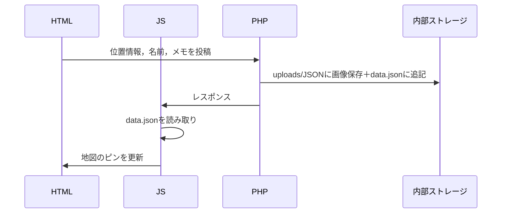

#　立ち上げ
docker-compose up --build

## シーケンス図

```mermaid
sequenceDiagram
    participant HTML
    participant JS
    participant PHP
    participant 内部ストレージ

    HTML->>PHP: 位置情報，名前，メモを投稿
    PHP->>内部ストレージ:  uploads/JSONに画像保存＋data.jsonに追記
    PHP->>JS: レスポンス
    JS->>JS: data.jsonを読み取り
    JS->>HTML: 地図のピンを更新
```
